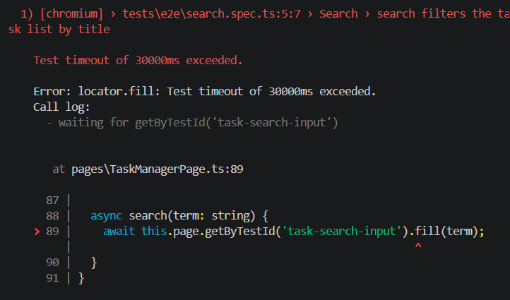
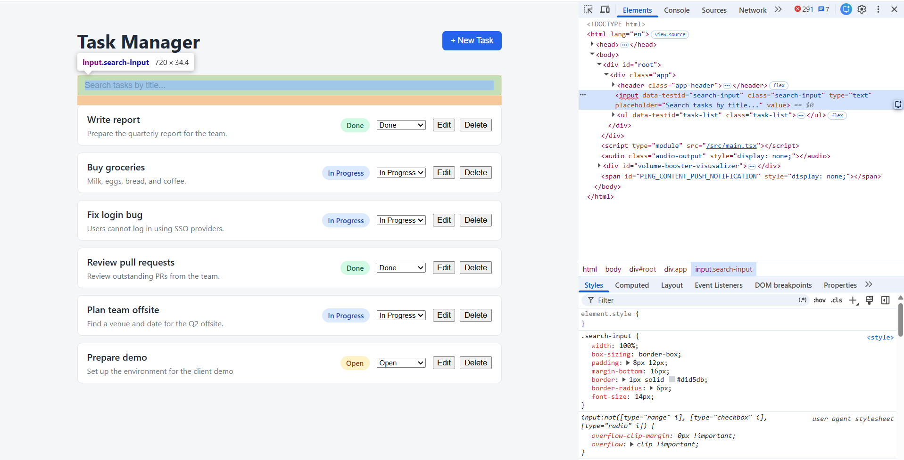
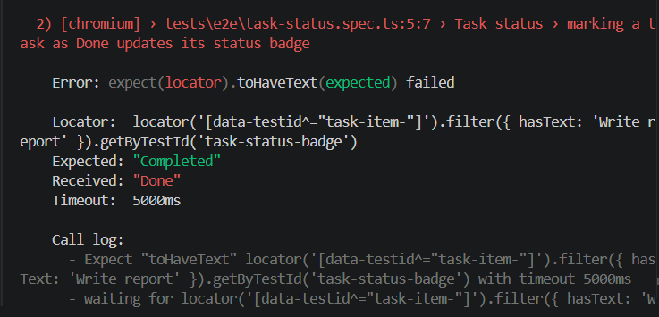
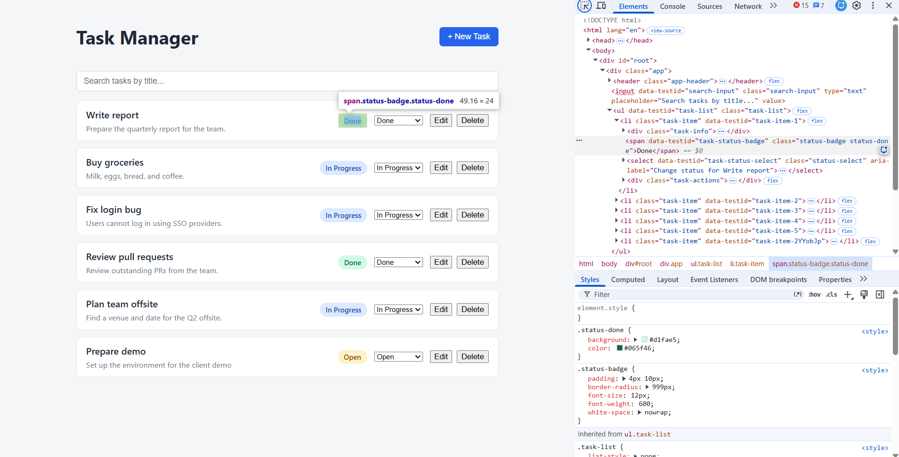

# Solution

## Task A — Root cause analysis

### Failing test 1: `search filters the task list by title` (`./tests/e2e/search.spec.ts`)

- **Root cause: The Page Object Model (POM)'s `search` method was using the incorrect `data-testid`, `task-search-input` while the search input in the application uses `search-input`. As a result, Playwright could not locate the search field and the test timed out.**

- **Fix applied: Updated the `search` method in `TaskManagerPage.ts` to use the correct existing `search-input` locator**

### Failing test 2: `marking a task as Done updates its status badge` (`./tests/e2e/task-status.spec.ts`)

- **Root cause: The test expects the task status badge to have text `Completed`, but the application uses `Done` as the status value**

- **Fix applied: Updated the expect statement for task status badge to `Done`**

## Task B — New test

- **Scenario covered: Cancelling an edit does not update the task**
- **Why this scenario matters / why it was missing: The existing tests check that an edit can be saved, but they don't check what happens when the user cancels the edit. I added this test to make sure any changes are discarded and the task stays the same.**

## Task C — API validation

- **What the new API test verifies: The test verifies that a new task can be created using the `POST /tasks` endpoint. It checks that the response returns status code `201`, contains the expected task fields, and that the title, description, and status match the values sent in the request.**

## Task D — Bug / usability / improvement report

- **What I observed:**
- **Steps to reproduce (if applicable):**
- **Why it matters:**
- **Suggested fix or improvement:**

## Anything else you'd like us to know

-
